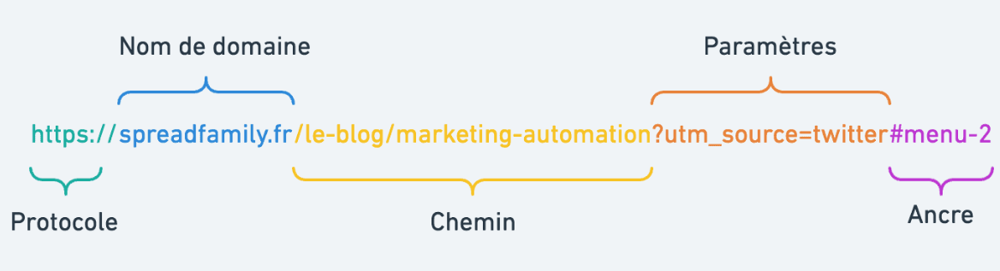

# Introduction aux URL

Une URL (Uniform Resource Locator) est une adresse utilisée pour localiser une ressource sur Internet. Elle est généralement utilisée pour accéder à des pages web, des images, des vidéos, des fichiers, etc. Une URL est composée de plusieurs parties principales :



1. **Protocole** : C'est la première partie de l'URL et spécifie la méthode utilisée pour récupérer la ressource. Les protocoles les plus courants sont HTTP et HTTPS.
2. **Nom d'hôte** : C'est l'adresse du serveur où réside la ressource. Il peut s'agir d'un nom de domaine (comme www.example.com) ou d'une adresse IP (comme 192.0.2.1).
3. **Port (optionnel)** : Si la ressource est hébergée sur un port spécifique du serveur, cela peut être spécifié dans l'URL. Par exemple, "www.example.com:8080".
4. **Chemin** : C'est la partie de l'URL qui indique l'emplacement spécifique de la ressource sur le serveur. Par exemple, "/index.html" pour un fichier HTML ou "/images/photo.jpg" pour une image.
5. **Fragment (optionnel)** : Il peut être utilisé pour spécifier une section particulière de la ressource. Par exemple, "#section1" pour accéder à la première section d'une page web.

## Exemple d'URL

Considérons l'exemple suivant :

```
https://www.example.com:8080/path/to/resource?param1=value1&param2=value2#section1
```

- Protocole : `https://`
- Nom d'hôte : `www.example.com`
- Port : `8080`
- Chemin : `/path/to/resource`
- Paramètres de requête : `param1=value1&param2=value2`
- Fragment : `#section1`

## Syntaxe générale d'une URL

La syntaxe générale d'une URL est la suivante :

```
protocole://nom_d_hote:port/chemin?paramètres_de_requête#fragment
```

## Utilisation des URL

Les URL sont utilisées dans de nombreux contextes, notamment pour accéder à des sites web, télécharger des fichiers, accéder à des API, etc. Les navigateurs web utilisent les URL pour charger des pages web à partir d'Internet, tandis que les applications utilisent les URL pour accéder à des ressources en ligne.

# Approfondissons davantage notre compréhension des URL

## 1. Protocoles

Les protocoles sont des règles et des conventions qui régissent la communication entre les clients et les serveurs sur Internet. Voici quelques protocoles couramment utilisés :

- **HTTP (Hypertext Transfer Protocol)** : Utilisé pour transférer des données hypertexte sur le web. Les URL commençant par "http://" utilisent ce protocole.
- **HTTPS (HTTP Secure)** : Une version sécurisée de HTTP qui utilise le chiffrement SSL/TLS pour sécuriser les communications. Les URL commençant par "https://" utilisent ce protocole.
- **FTP (File Transfer Protocol)** : Utilisé pour transférer des fichiers entre un client et un serveur. Les URL commençant par "ftp://" utilisent ce protocole.
- **SMTP (Simple Mail Transfer Protocol)** : Utilisé pour transférer des e-mails entre les serveurs de messagerie. Les URL commençant par "smtp://" ne sont pas courantes dans le contexte des navigateurs web, mais sont utilisées dans certains cas spécifiques.

## 2. Nom de domaine

Les noms de domaine servent à identifier de manière conviviale les adresses IP des serveurs sur Internet. Ils sont composés de plusieurs parties :

- **Sous-domaine** : Il peut être facultatif et précède le nom de domaine principal. Par exemple, dans "www.example.com", "www" est un sous-domaine.
- **Nom de domaine principal (ou domaine racine)** : C'est le nom de base du site. Dans "www.example.com", "example.com" est le nom de domaine principal.
- **Extension de domaine** : Il indique la catégorie ou le type d'organisation du site. Par exemple, dans "www.example.com", ".com" est l'extension de domaine.

### Fonctionnement du DNS

1. **Demande de résolution DNS** : Lorsque vous saisissez un nom de domaine dans votre navigateur web (par exemple, www.example.com) et que vous appuyez sur Entrée, votre ordinateur envoie une demande de résolution DNS à un serveur DNS.
2. **Serveur DNS local** : Votre ordinateur interroge d'abord son serveur DNS local. Si le serveur DNS local a déjà enregistré la correspondance entre le nom de domaine et son adresse IP dans son cache, il renvoie immédiatement l'adresse IP correspondante.
3. **Serveur DNS racine** : Si le serveur DNS local ne peut pas résoudre le nom de domaine, il envoie une demande à un serveur DNS racine.
4. **Serveurs DNS de domaine de premier niveau (TLD)** : Ces serveurs sont responsables des extensions de domaine telles que .com, .net, .org, etc.
5. **Serveurs DNS autoritaires** : Ils contiennent les enregistrements DNS réels pour les domaines spécifiques. Ils fournissent les réponses finales aux requêtes de résolution DNS.
6. **Réponse DNS** : Une fois que le serveur DNS autoritaire a trouvé la correspondance entre le nom de domaine et son adresse IP, il envoie cette information au serveur DNS local, qui la transmet à votre ordinateur.

## 3. Ports

Le port spécifie un point d'accès sur le serveur pour accéder à une application ou à un service spécifique. Par défaut, les navigateurs utilisent le port 80 pour HTTP et le port 443 pour HTTPS.

## 4. Chemin

Le chemin dans une URL spécifie l'emplacement spécifique de la ressource sur le serveur. Il peut inclure des répertoires, des sous-répertoires et des noms de fichiers.

## 5. Paramètres de requête

Les paramètres de requête sont utilisés pour passer des données à une ressource lors d'une requête HTTP GET. Ils sont ajoutés à la fin de l'URL après un point d'interrogation (?), et sont sous la forme "clé=valeur".

### Structure des paramètres de requête

Les paramètres de requête sont ajoutés à la fin de l'URL après un point d'interrogation (?), et sont séparés par des ampersands (&). Chaque paramètre est composé d'une clé et d'une valeur, séparées par un signe égal (=). Par exemple :

```
https://www.example.com/search?query=apple&category=fruits
```

Dans cet exemple, nous avons deux paramètres de requête : `query=apple` et `category=fruits`.

- `query` est la clé du premier paramètre, et `apple` est sa valeur.
- `category` est la clé du deuxième paramètre, et `fruits` est sa valeur.

## 6. Fragment

Le fragment permet de pointer vers une section spécifique d'une ressource HTML. Il est indiqué par un signe dièse (#) suivi d'un identifiant de fragment.

### Exemple :

```
https://www.example.com#section1
```

Dans cet exemple, le fragment `#section1` permet d'accéder directement à la section ayant l'ID "section1" sur la page web.

## Conclusion

Comprendre en profondeur les composants d'une URL est essentiel pour naviguer sur Internet et développer des applications web. Les URL sont la base de la communication sur le web et leur compréhension est cruciale pour tirer le meilleur parti des ressources en ligne.


### 2 Approfondissement sur les DNS (Domain Name System)

Le **DNS** (Domain Name System) est un service essentiel sur Internet qui permet de convertir des noms de domaine lisibles par l’homme (par exemple, www.example.com) en adresses IP que les ordinateurs utilisent pour localiser des serveurs sur le réseau.

#### Fonctionnement détaillé du DNS
1. **Résolution directe et inversée** :
   - La **résolution directe** consiste à convertir un nom de domaine en adresse IP. Exemple : www.example.com -> 192.0.2.1.
   - La **résolution inversée** permet de faire le contraire, c'est-à-dire convertir une adresse IP en nom de domaine, ce qui est utile dans des situations comme le débogage ou la gestion de réseau.

2. **Hiérarchie des serveurs DNS** :
   - Le système DNS est hiérarchique. Il y a plusieurs niveaux de serveurs :
     - **Serveurs racines** : Ils sont les premiers à être consultés lors d'une requête DNS. Ils redirigent vers des serveurs TLD (Top-Level Domain) en fonction de l'extension du domaine (.com, .net, .org, etc.).
     - **Serveurs TLD** : Ces serveurs sont responsables de la gestion des domaines de premier niveau (comme .com ou .fr). Ils redirigent ensuite vers les serveurs DNS autoritaires pour un domaine donné.
     - **Serveurs DNS autoritaires** : Ils détiennent les informations finales concernant le domaine en question, y compris les adresses IP associées.

3. **Temps de cache DNS** :
   - Pour optimiser les requêtes, les serveurs DNS conservent les réponses en cache pour une durée déterminée (TTL - Time to Live). Cela permet de répondre plus rapidement à des requêtes fréquentes concernant le même domaine.

4. **Types d'enregistrements DNS** :
   - Le DNS utilise plusieurs types d'enregistrements pour fournir différentes informations sur un domaine :
     - **A Record** (Address Record) : Associe un nom de domaine à une adresse IP (IPv4).
     - **AAAA Record** : Associe un nom de domaine à une adresse IPv6.
     - **CNAME Record** (Canonical Name Record) : Indique qu'un nom de domaine est un alias pour un autre domaine.
     - **MX Record** (Mail Exchange Record) : Indique les serveurs de messagerie utilisés par le domaine.
     - **TXT Record** : Permet de stocker des informations textuelles, souvent utilisées pour la vérification des domaines (ex : enregistrements SPF pour la sécurité des e-mails).

### Exemple de résolution DNS

1. **Demande initiale** : Un utilisateur entre "www.example.com" dans son navigateur.
2. **Interrogation du cache local** : Le système d’exploitation de l’utilisateur vérifie d'abord si une correspondance est déjà stockée en cache local.
3. **Serveur DNS récursif** : Si aucune correspondance n’est trouvée, une requête est envoyée à un **serveur DNS récursif** qui agit comme intermédiaire et envoie la demande aux serveurs appropriés.
4. **Serveur racine** : Le serveur récursif contacte un **serveur DNS racine**, qui retourne l'adresse d'un serveur TLD (par exemple, pour ".com").
5. **Serveur TLD** : Le serveur TLD retourne l'adresse du **serveur DNS autoritaire** pour le domaine "example.com".
6. **Serveur DNS autoritaire** : Ce dernier renvoie finalement l'adresse IP correspondant à "www.example.com".
7. **Réponse DNS** : L'adresse IP est renvoyée au serveur récursif, qui la transmet à l'ordinateur de l'utilisateur, lui permettant d'accéder à la ressource demandée.

### Conclusion

Le DNS est l'un des piliers fondamentaux d'Internet, car il permet de traduire les noms de domaine en adresses IP, facilitant ainsi la navigation et la communication entre les machines. La compréhension de son fonctionnement est cruciale pour tout développeur travaillant avec des applications web ou réseaux.

Cela enrichit le cours initial sur les URL en fournissant un aperçu plus technique du rôle que joue le DNS dans la navigation sur Internet.
```